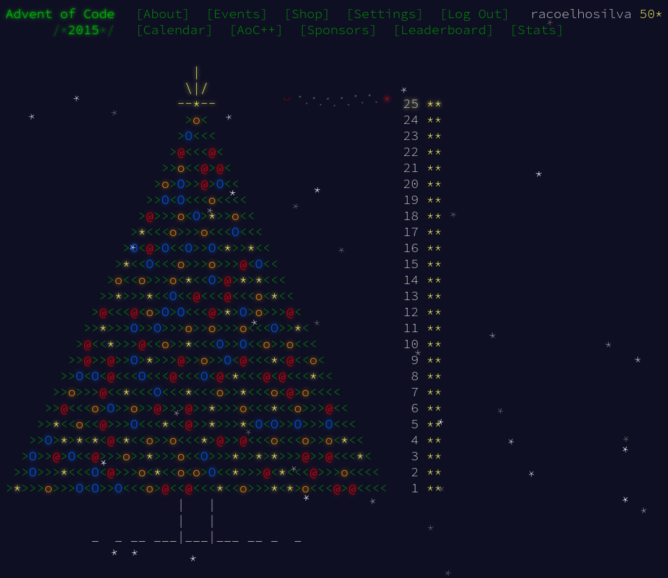

<h1 align="center">
    Advent of Code 2015 Solutions
</h1>

> Collection of my solutions to [Advent of Code 2015](https://adventofcode.com/2015) in Python

## Context

Santa was hoping for a white Christmas, but his weather machine's "snow" function is powered by stars, and he's fresh out! To save Christmas, he needs you to collect fifty stars by December 25th.  
Collect stars by helping Santa solve puzzles. Two puzzles will be made available on each day in the Advent calendar; the second puzzle is unlocked when you complete the first. Each puzzle grants one star. Good luck!

## Progress Tracking (Stars)

| Total | 50 |
|:---:|:---:|

| Title | Stars | Languages |
| --- |:---:| ---:|
| Day 1: Not Quite Lisp | ★★ | Python | 
| Day 2: I Was Told There Would Be No Math | ★★ | Python | 
| Day 3: Perfectly Spherical Houses in a Vacuum | ★★ | Python | 
| Day 4: The Ideal Stocking Stuffer | ★★ | Python | 
| Day 5: Doesn't He Have Intern-Elves For This? | ★★ | Python | 
| Day 6: Probably a Fire Hazard | ★★ | Python | 
| Day 7: Some Assembly Required | ★★ | Python | 
| Day 8: Matchsticks | ★★ | Python | 
| Day 9: All in a Single Night | ★★ | Python | 
| Day 10: Elves Look, Elves Say | ★★ | Python | 
| Day 11: Corporate Policy | ★★ | Python | 
| Day 12: JSAbacusFramework.io | ★★ | Python | 
| Day 13: Knights of the Dinner Table | ★★ | Python | 
| Day 14: Reindeer Olympics | ★★ | Python | 
| Day 15: Science for Hungry People | ★★ | Python | 
| Day 16: Aunt Sue | ★★ | Python | 
| Day 17: No Such Thing as Too Much | ★★ | Python | 
| Day 18: Like a GIF For Your Yard | ★★ | Python | 
| Day 19: Medicine for Rudolph | ★★ | Python | 
| Day 20: Infinite Elves and Infinite Houses | ★★ | Python | 
| Day 21: RPG Simulator 20XX | ★★ | Python | 
| Day 22: Wizard Simulator 20XX | ★★ | Python | 
| Day 23: Opening the Turing Lock | ★★ | Python | 
| Day 24: It Hangs in the Balance | ★★ | Python | 
| Day 25: Let It Snow | ★★ | Python | 

## Proof of Completion

